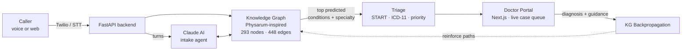

<div align="center">

# Claude_Hackathon · WHO-Aligned AI Health Access

**Telehealth intake for underserved populations - voice/web, a self-evolving medical knowledge graph, and a doctor dashboard that teaches the graph back.**

<br/>


</div>

---

## TL;DR

A caller dials a phone number, speaks their symptoms, and within ~90 seconds a licensed doctor somewhere else sees a structured case - ICD-11 coded, triage-scored, with predicted conditions ranked by a graph that **learns from every doctor response**. Built for jurisdictions where in-person access is the bottleneck.

| | |
|---|---|
| **Phone**           | **+1 (478) 812-5405** |
| **Doctor portal**   | https://doctor-portal-flax.vercel.app |
| **Backend API**     | https://claude-hackathon-u86l.onrender.com · [docs](https://claude-hackathon-u86l.onrender.com/docs) |
| **Web caller sim**  | https://claude-hackathon-u86l.onrender.com/call |

Production deploy notes in [`docs/DEPLOY.md`](docs/DEPLOY.md) (Supabase · Render · Twilio).

---

## How it works



The graph is **Physarum-inspired** - nodes activate, edges carry conductivity that decays without use and strengthens along correct paths when a doctor confirms a diagnosis. The system genuinely gets better with every closed case.

---

## Caller flow

1. Dial **+1 (478) 812-5405** (or open `/call`).
2. Country is inferred from the number; the WHO-mandated verbal disclosure for that tier is played.
3. Caller describes symptoms: *"I have fever and headache for three days."*
4. Backend extracts symptoms via KG node matching.
5. KG Navigator activates candidate conditions (Malaria, Dengue, Meningitis…) and scores follow-up questions.
6. Claude composes a natural reply incorporating the top KG-suggested question.
7. 3–5 turns capture severity, duration, body region.
8. Auto-submit when completion criteria are met (5+ symptoms, high KG confidence, or 6+ turns).
9. Backend runs **START triage**, maps to **ICD-11** via the NLM API, computes a priority score.
10. Case appears on the Doctor Portal within ~5s.

## Doctor flow

1. Open the portal → dashboard shows live case count, triage distribution, country breakdown.
2. Case detail view: symptoms, AI notes, red flags, **KG Insights** panel with predicted conditions & recommended specialty.
3. Doctor submits diagnosis + guidance.
4. **KG Backpropagation** fires - correct symptom → condition edges strengthen, wrong ones weaken. The graph learns.
5. `/knowledge-graph` page visualises hottest pathways and lets you explore the graph symptom-by-symptom.

---

## Architecture

### Backend - FastAPI (Render)

```
backend/
├── main.py                         # FastAPI app · CORS · lifespan · router registration
├── config.py · database.py · models.py
├── routers/
│   ├── caller.py · twilio_voice.py · cases.py · doctors.py
│   ├── knowledge_graph.py · intake.py · health_data.py
├── services/
│   ├── case_service.py             # creation, completion, priority
│   ├── country_service.py          # phone parsing, 4-tier permissions
│   ├── triage_service.py           # START + emergency detection
│   ├── icd11_service.py            # NLM ICD-11 mapping
│   ├── intake_service.py           # Claude intake orchestration
│   ├── priority_queue.py · scheduler_service.py · who_service.py
├── knowledge_graph/
│   ├── graph_engine.py             # Physarum core: conductivity, decay, chemotaxis
│   ├── seed_data.py                # 106 symptoms · 80 conditions · 22 specialties · 600+ edges
│   ├── navigator.py                # Activation spreading, question scoring
│   ├── backpropagator.py           # Post-case reinforcement
│   ├── doctor_matcher.py · builder.py · data_pipeline.py
│   ├── simulation.py · scraper.py
├── static/caller.html              # Web caller (STT + ElevenLabs TTS)
└── test_e2e.py                     # 41 E2E tests · 97% pass
```

### Doctor Portal - Next.js (Vercel)

```
doctor-portal/
├── app/
│   ├── page.tsx                    # Live stats, triage chart, doctor status
│   ├── cases/
│   │   ├── page.tsx                # Filterable / sortable queue · auto-refresh · audio ping
│   │   └── [id]/page.tsx           # Case detail + KG insights + response form
│   ├── knowledge-graph/page.tsx    # KG explorer
│   └── layout.tsx · globals.css
```

---

## Quick start

```bash
# Backend (local)
cd backend
python -m venv .venv && source .venv/bin/activate
pip install -r requirements.txt
uvicorn main:app --reload

# Doctor portal
cd doctor-portal && npm install && npm run dev
```

Environment keys needed: `ANTHROPIC_API_KEY`, `DATABASE_URL`, `TWILIO_*`, `ELEVENLABS_API_KEY`, `NLM_ICD11_KEY`. Full list in `.env.example`.

---

## What's interesting here

- **The graph is the main character.** It's not a retrieval index - it's a living structure that encodes which symptom-chains actually led to which diagnoses.
- **Country-aware disclosure tiers.** Regulatory posture differs per jurisdiction; the system matches.
- **Triage ≠ diagnosis.** START gets you an urgency category fast; the doctor still diagnoses.
- **97% E2E pass on 41 tests.** Built in hackathon time, tested like a product.

---

## Roadmap

- [ ] Extend KG seed beyond 106 symptoms (cross-language clinical term ingestion)
- [ ] Wire ElevenLabs TTS variants per locale
- [ ] Add clinician-in-the-loop retraining cadence (weekly vs per-case)
- [ ] FHIR export for integration with EHRs

---

<div align="center">
<sub>Built for the Claude Hackathon · Part of <a href="https://github.com/pbathuri">@pbathuri</a>'s <a href="https://github.com/pbathuri/Map_Projects_MAC">project portfolio</a></sub>
</div>
