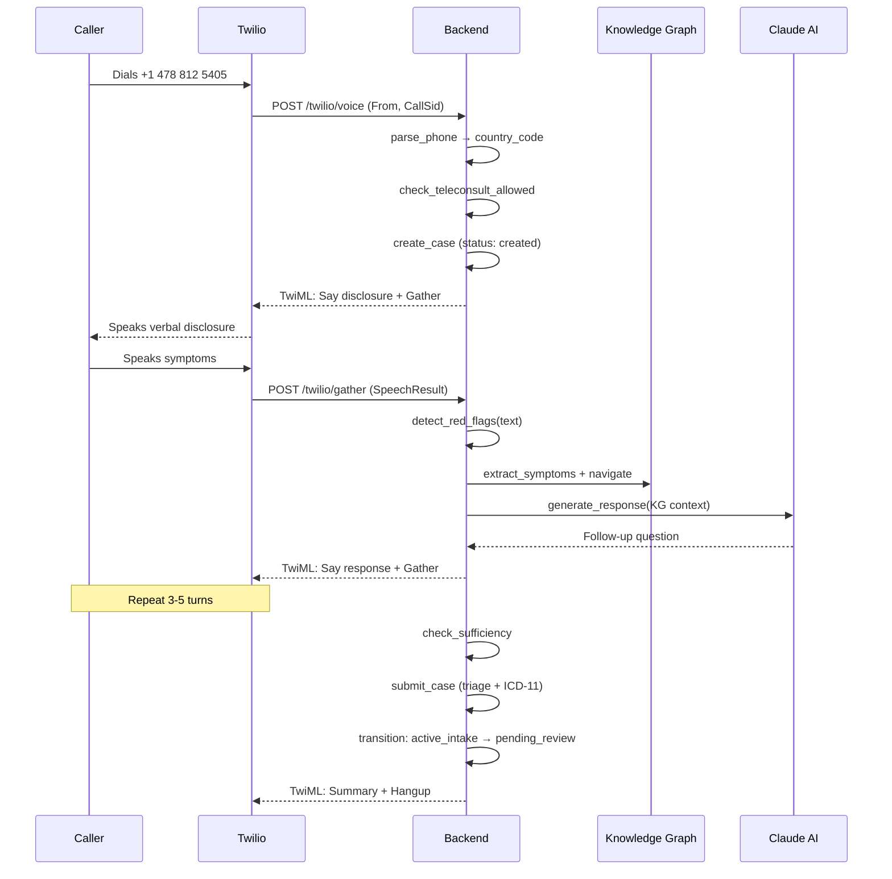
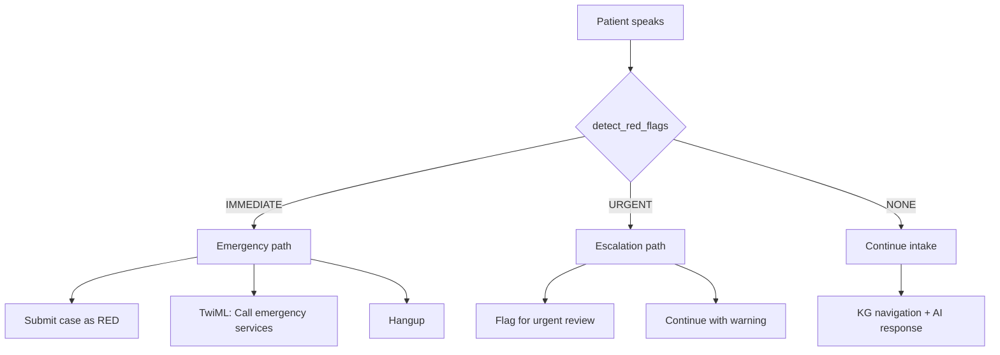
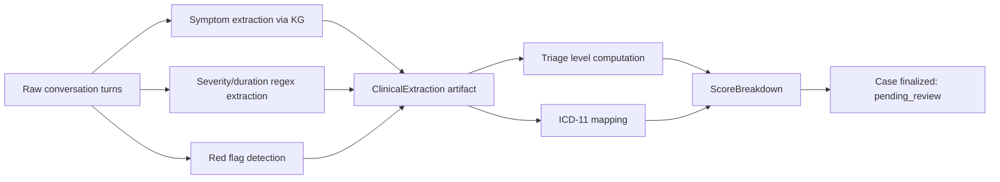
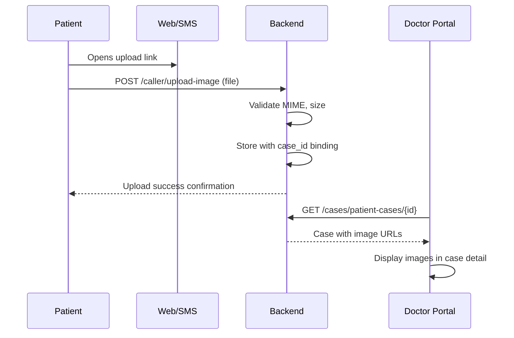
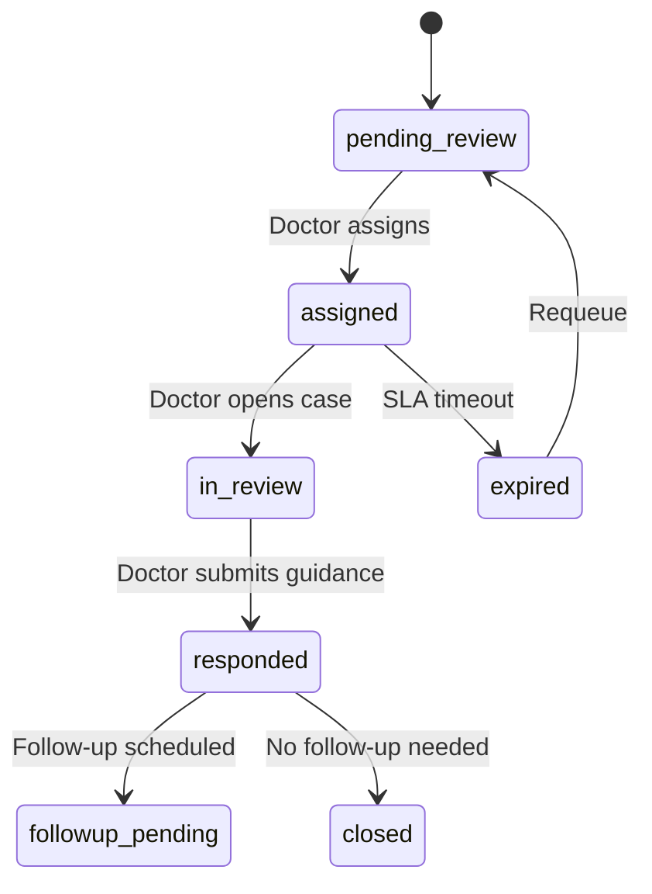
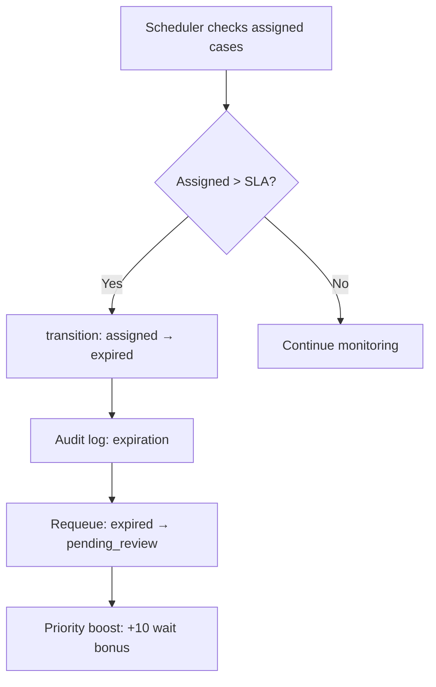
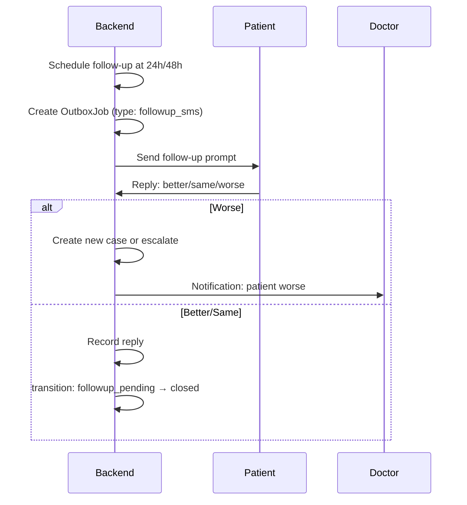
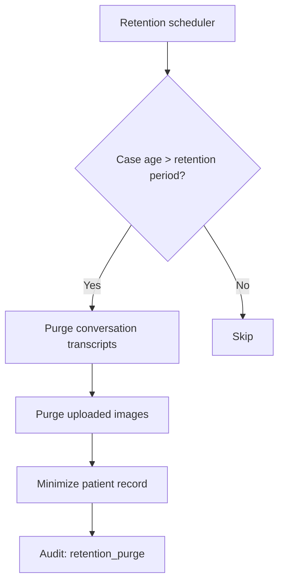
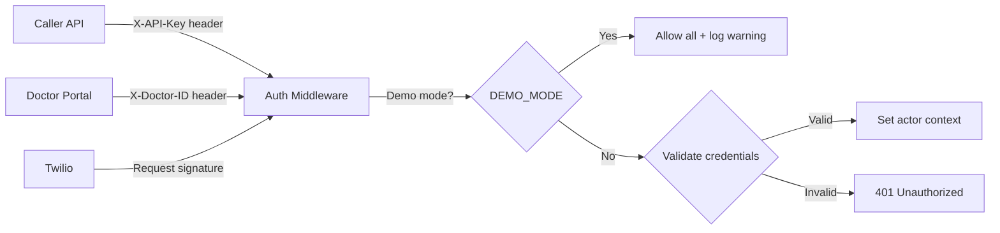
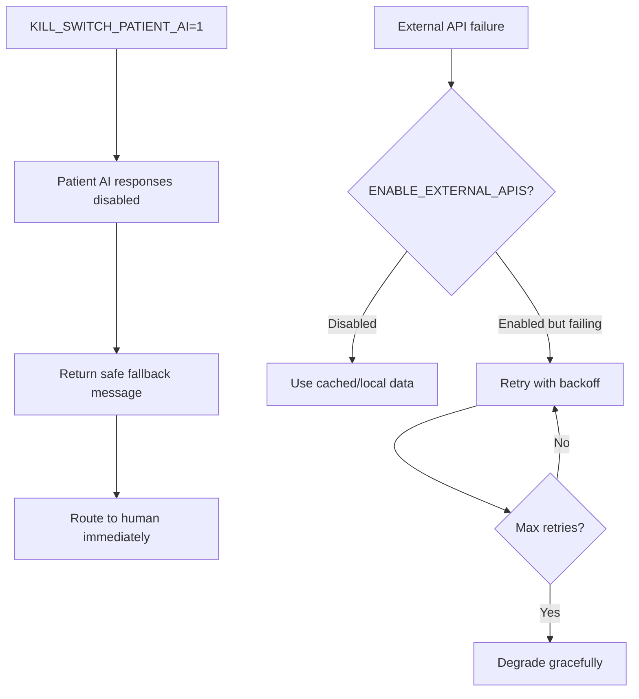

# Workflow Maps

## 1. Inbound Voice Intake

## 2. Emergency Short-Circuit

## 3. Structured Extraction and Case Finalization

## 4. Image Upload and Review

## 5. Doctor Assignment and Response

## 6. Expiration and Requeue

## 7. Follow-up Scheduling and Reply

## 8. Privacy Retention and Deletion

## 9. Service-to-Service Auth

## 10. Incident / Degraded Mode / Kill Switch

